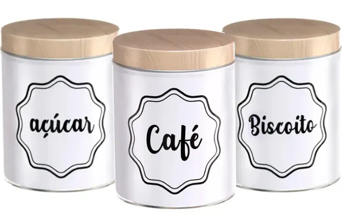
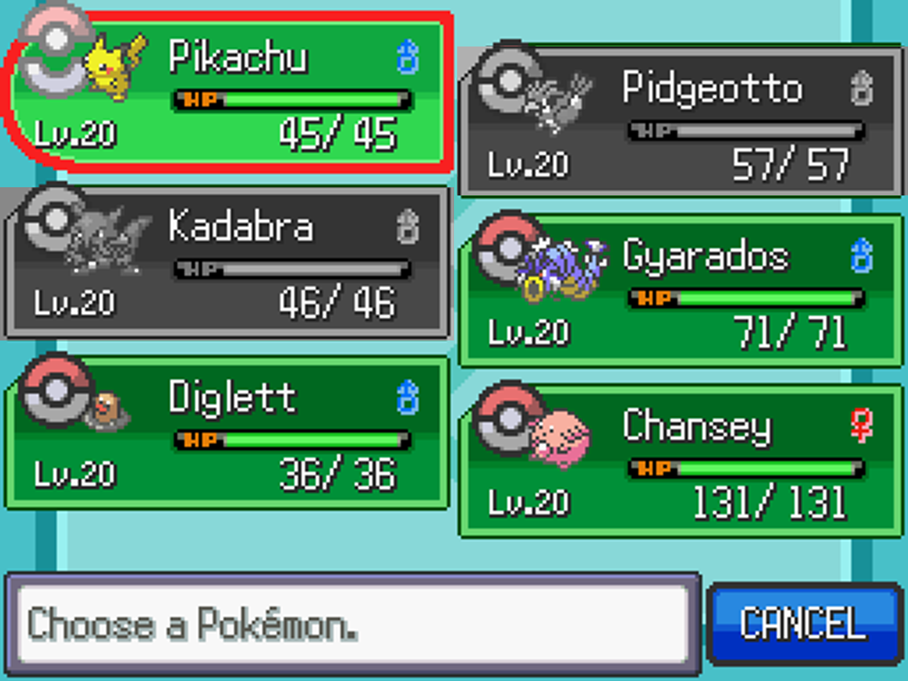
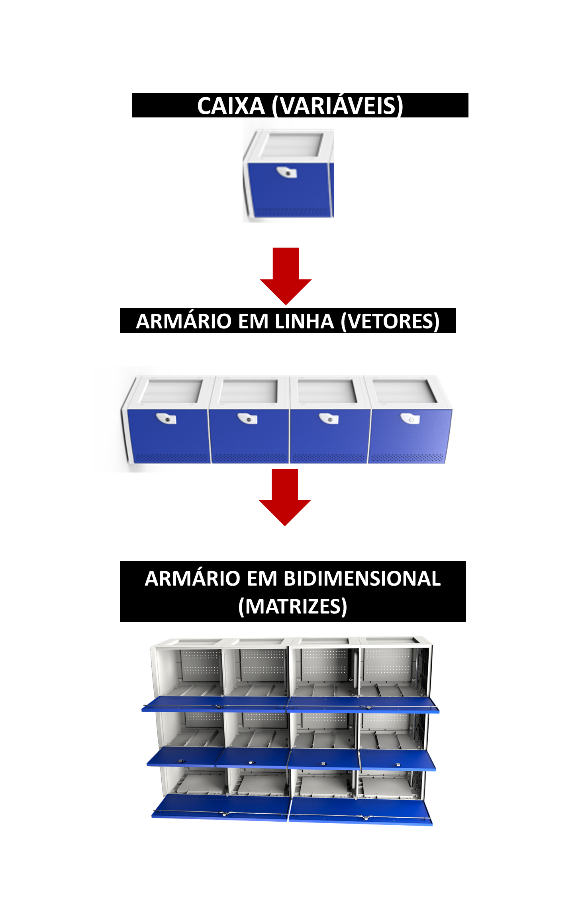

# 🧠 Blip - Lógica de Programação | Módulo 1


Repositório criado para armazenar os projetos, exercícios e exemplos desenvolvidos durante o **Módulo 1 do curso Blip - Lógica de Programação**, oferecido pela **DIO (Digital Innovation One)**.
---
## 📚 certificados
   
   


---

## 📚 Conteúdo do Módulo 1

Neste módulo foram abordados os conceitos iniciais da programação, como:

- Entrada e saída de dados  
- Variáveis  
- Tipos de dados (string, number, boolean)  
- Concatenação  
- Simulação de cenários com variáveis  
- Organização de código em arquivos `.js`

---
##📚 Imagens script.js

variaveis_e_constantes

   
---
Vetores_e_matrizes





---
## 🚀 Scripts Desenvolvidos
## 📚 variaveis_e_constantes

### ✅ script.js — Mensagem no Console e Variáveis

```js
//exibr uma mensagem no console
console.log("Digite o nome do seu jogador")

// declara a variavel
let nickname = "Pedro mxr"

//concatena a variavel com o texto
console.log("Bem vindo ao jogo" + nickname)
console.log(nickname + "entrou no jogo")

---
### ✅ script2.js — Sistema de Notificações

const notificacao = "Pokemon Go diz: "

//saida
console.log(notificacao + "tem um novo pokemon na região")
console.log(notificacao + "você foi derrotado por um líder")

---
### ✅ script3.js — Simulação da Cozinha da Vovó


let poteCafe = "café pilão"
let poteAcucar = "Açucar cristal"
let poteBiscoito = "Biscoito Maizena"
const messagemDaVovo = "Na cozinha da vovó hoje tem: "

console.log(messagemDaVovo + 
poteCafe + " - " +
poteAcucar + " - " +
poteBiscoito
)

poteCafe = "Café 3 corações"

console.log(messagemDaVovo + 
poteCafe + " - " +
poteAcucar + " - " +
poteBiscoito
)

---
### ✅ script4.js — Cadastro de Pokémon


//pokemon
let nomePokemon = "pikachu"
let pokemonSexo = "M"
let nivelPokemon = 20
let pontosDeVidaPokemon = 45
let selecionavel = false

---
### ✅ script5.js — Cadastro de Pessoa
// nome, idade, numero de telefone, cpf, endereço, recebePensao
//string = armazena texto
// number = armazena numeros
// boolean = armazena valores logicos

let nomePessoa = "Iolanda amaral"
let idade = 75
let numeroTelefone = "(17) 98471-3388"
let cpf = "321.321.321-32"
let endereco = "Rua das flores, numero 321, bairro jardim das rosas"
let recebePensao = true

---

## 📚 Vetores_e_matrizes
### ✅ script.js
let nomesPokemon = ["Pikachu" , "Chamander", "Bulbassaur"]
let timePokemon = [
  ["pikachu", "M", 1],
  ["Chamander", "F", 3]
]


console.log(" O pokemon " + timePokemon[1][0] + " é do sexo " +  timePokemon[1][1] + 
" e está no nível " + timePokemon[1][2] )


