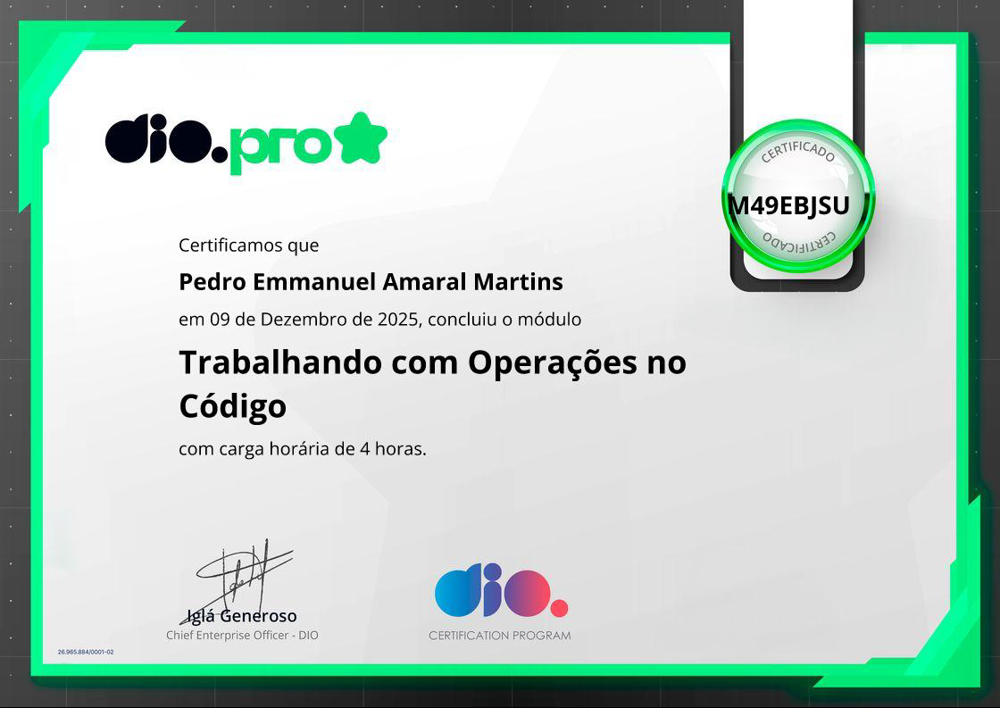
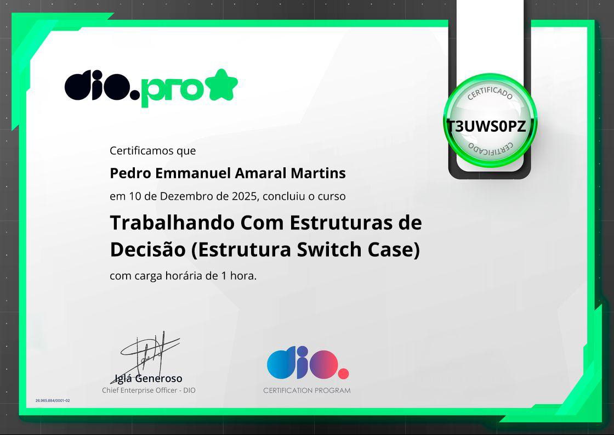
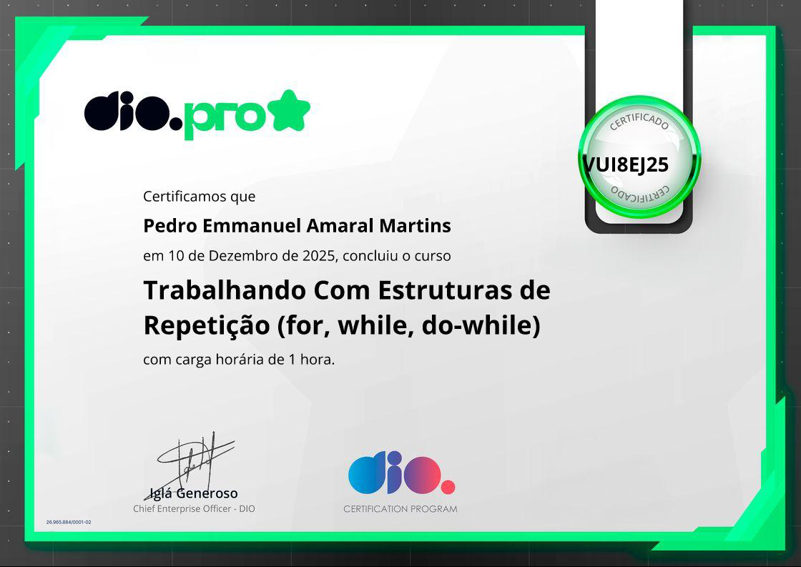

# 🧠 Blip - Lógica de Programação | Módulo 1
## 📚 certificados
   
   

---

# 🧠 Blip - Lógica de Programação | Módulo 2
## 📚 certificados
   

---

# 🧠 Blip - Lógica de Programação | Módulo 3
## 📚 certificados
   
   

---

# 🧠 Blip - Lógica de Programação | Módulo 4
## 📚 certificados
   
 

---

# 🧠 Blip - Lógica de Programação | Módulo 5
## 📚 certificados
   
 
