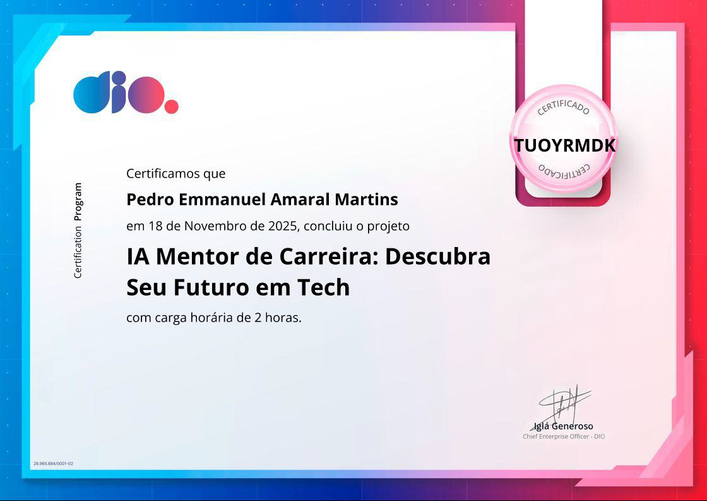

# Certificados – Módulo 3

Aqui estão os certificados referentes ao **Módulo 3** do curso **CAIXA - Inteligência Artificial na Prática** da DIO.

---

## 📄 Certificados

> Todos os certificados estão disponíveis como imagens JPEG e podem ser visualizados diretamente aqui no GitHub.

