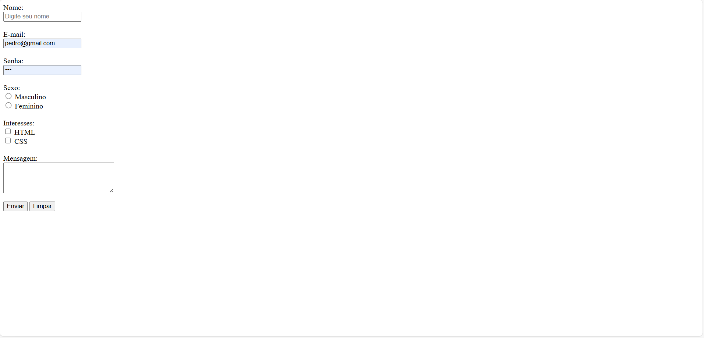
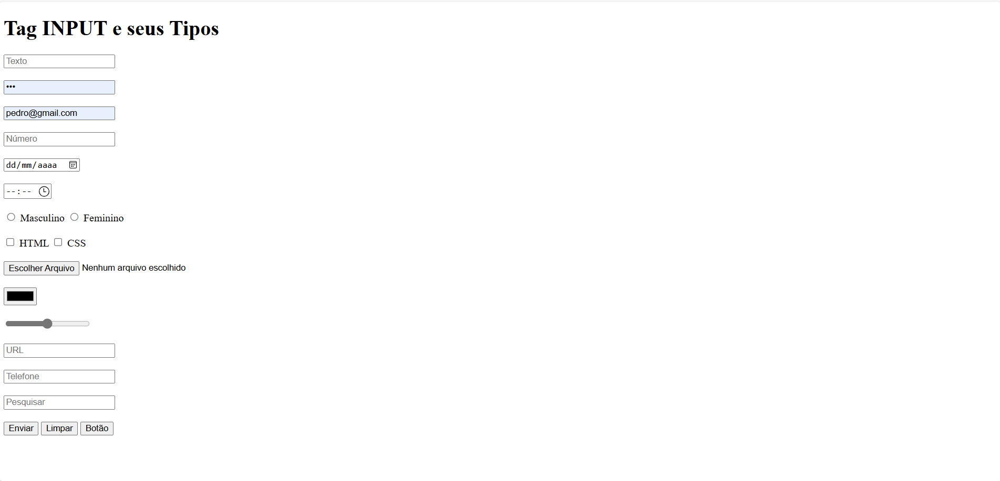
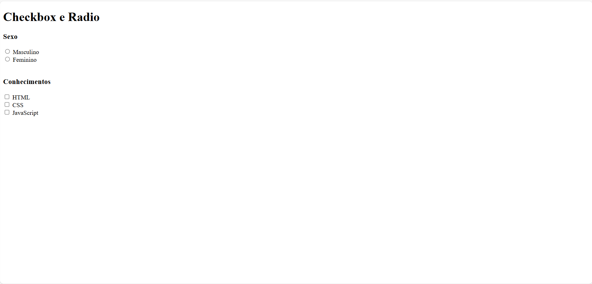
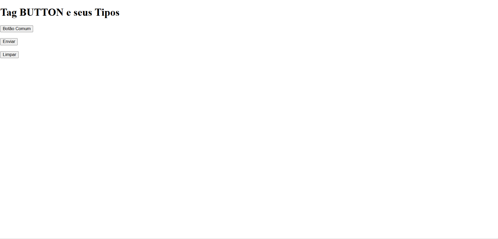
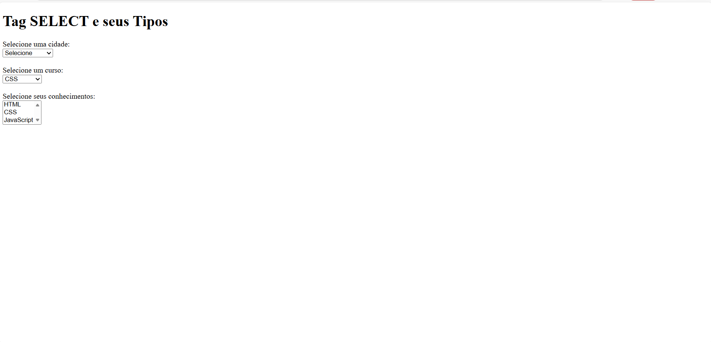
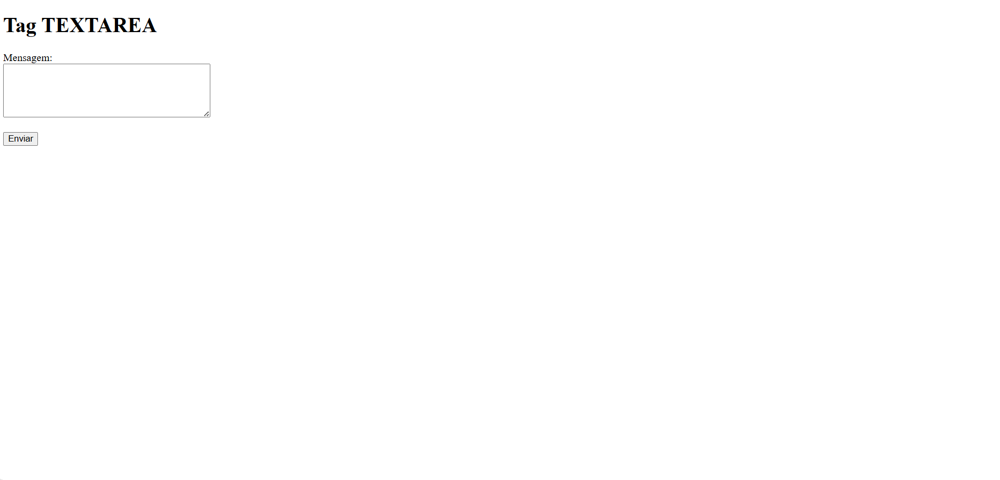
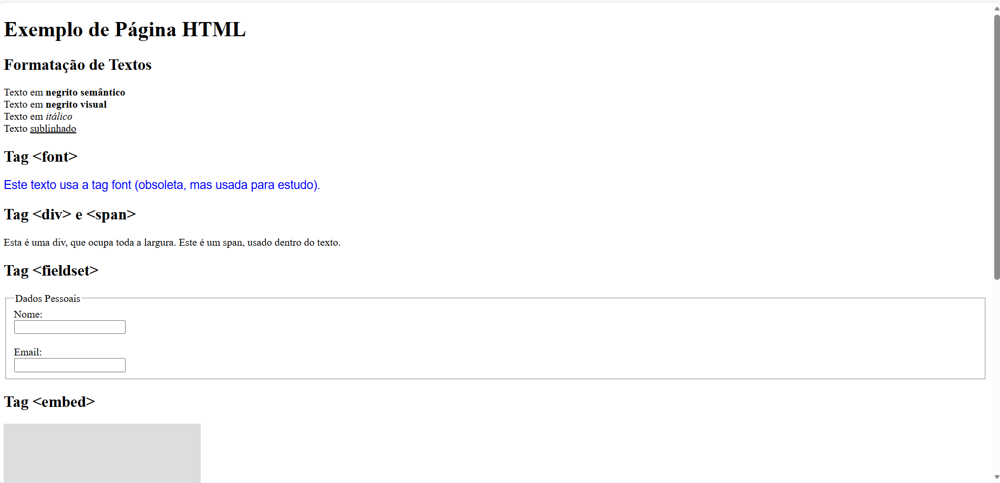
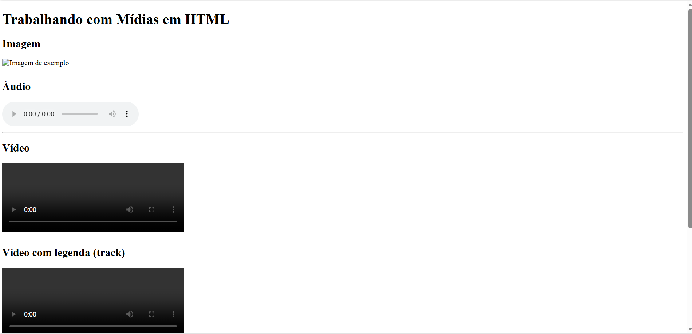
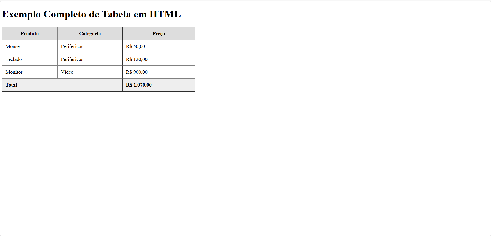
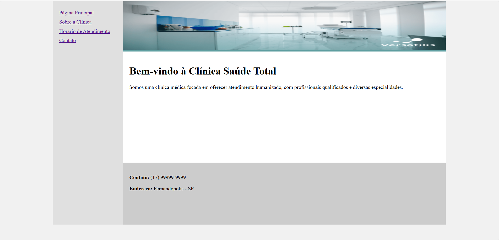

# 📘 Formação HTML Web Developer – Projetos Práticos

Este repositório reúne todos os projetos desenvolvidos durante meus estudos em **HTML5**, como parte da **Formação HTML Web Developer – DIO.me**.

Os projetos foram criados com foco na prática dos conceitos fundamentais do HTML, incluindo estruturação de páginas, formatação de texto, formulários, tabelas, mídias e um desafio final integrador.

---

## 📂 Projetos

---

## 🟢 01 – Formulários em HTML

### 📌 Descrição
Conjunto de exemplos práticos demonstrando o uso completo de formulários em HTML, explorando diferentes tipos de inputs, validações e organização semântica.

### 🔧 Conceitos aplicados
- `<form>`
- `<input>` (text, password, email, number, date, radio, checkbox, file, color, range, url, tel, search, hidden)
- `<textarea>`
- `<button>`
- `<select>` e `<option>`
- Validações (`required`, `placeholder`)
- Radio e Checkbox

📸 **Print do projeto:**  

---

## 🟢 02 – Texto e Estruturação em HTML

### 📌 Descrição
Projeto focado na organização e formatação de textos, utilizando tags semânticas e estruturais para melhor leitura e hierarquia do conteúdo.

### 🔧 Conceitos aplicados
- Títulos (`<h1>` a `<h6>`)
- Parágrafos (`
`)
- Formatação (`<strong>`, `<b>`, `<i>`, `<u>`)
- `
` e ``
- `<fieldset>` e `<legend>`
- `<embed>`
- `<iframe>`
- Uso didático da tag `` (obsoleta)

📸 **Print do projeto:**  

---

## 🟢 03 – Mídias em HTML

### 📌 Descrição
Demonstração prática da utilização de mídias em páginas HTML, incluindo conteúdos internos e externos.

### 🔧 Conceitos aplicados
- Imagens (``)
- Áudio (`<audio>`)
- Vídeo (`<video>`)
- Legendas (`<track>`)
- Iframe com conteúdo externo (YouTube)

📸 **Print do projeto:**  

---

## 🟢 04 – Tabelas em HTML

### 📌 Descrição
Projeto demonstrando a criação de tabelas completas em HTML, organizadas de forma semântica.

### 🔧 Conceitos aplicados
- `<table>`
- `<thead>`
- `<tbody>`
- `<tfoot>`
- `<tr>`, `<th>`, `<td>`
- `cellpadding`, `cellspacing`
- `colspan`

📸 **Print do projeto:**  

---

## 🟢 05 – Desafio Final – Clínica Médica

### 📌 Descrição
Projeto final do módulo onde foi desenvolvido um site completo para uma clínica médica, utilizando HTML e CSS básico, aplicando todos os conceitos estudados.

### 📄 Páginas desenvolvidas
- Página Principal
- Sobre a Clínica
- Horário de Atendimento
- Contato

📸 **Print do projeto:**  

---

## 🛠️ Tecnologias Utilizadas
- HTML5
- CSS3 (básico)

---

## 🎯 Objetivo
Consolidar os conhecimentos fundamentais de HTML e criar uma base sólida para estudos futuros em CSS, JavaScript e desenvolvimento web.

---

📌 *Projetos desenvolvidos para fins educacionais.*
