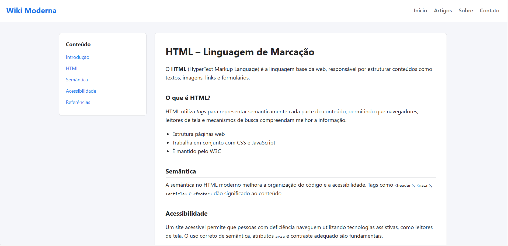

# 📘 Wiki Moderna — Recriando a Wikipedia com Layout Profissional

Projeto desenvolvido como parte do **Módulo 3 – Trilha HTML**, com o objetivo de recriar a experiência da Wikipedia utilizando um **layout moderno**, boas práticas de **HTML semântico**, **acessibilidade** e **organização visual profissional**, tornando-o apto para portfólio.

---

## 🎯 Objetivo do Projeto

Este projeto tem como finalidade aplicar, na prática:

- Estruturação correta de páginas HTML
- Uso de **semântica moderna**
- Princípios de **acessibilidade (a11y)**
- Organização de layout com CSS
- Criação de uma interface limpa, moderna e responsiva

Tudo isso simulando um **cenário real de mercado**, indo além de um exemplo básico de curso.

---

## 🧠 Conceitos Aplicados

- **HTML5 Semântico**
  - Uso correto de `header`, `main`, `article`, `aside`, `nav` e `footer`
- **Acessibilidade**
  - Atributos `aria-label`
  - Estrutura hierárquica de títulos
  - Navegação clara para leitores de tela
- **CSS Moderno**
  - Variáveis CSS (`:root`)
  - Layout com **CSS Grid**
  - Design responsivo
- **Boas Práticas**
  - Código organizado
  - Separação lógica de responsabilidades
  - Conteúdo estruturado e legível

---

## 🧩 Estrutura do Layout

- **Header**
  - Identidade visual do projeto
  - Navegação principal
- **Menu Lateral (Aside)**
  - Índice de conteúdo com âncoras
- **Conteúdo Principal (Article)**
  - Texto informativo organizado em seções
- **Footer**
  - Créditos e link para GitHub

---

## 📸 Print do Projeto

Adicione abaixo um print da tela principal do projeto:

---

## 🚀 Tecnologias Utilizadas

- HTML5
- CSS3
- Layout Responsivo
- Princípios de Acessibilidade Web (WAI-ARIA)

---

## 📚 Referências Utilizadas

- [MDN Web Docs](https://developer.mozilla.org/pt-BR/docs/Web/HTML)
- [W3C](https://www.w3.org/)
- [Wikipedia](https://pt.wikipedia.org)

---

## 👨‍💻 Autor

Desenvolvido por **Pedro Emmanuel Amaral Martins**  
Estudante de Sistema de Informação • Front-end Developer  

🔗 GitHub: [PedroMartinsam](https://github.com/PedroMartinsam)

---

## 📌 Observações

Este projeto foi desenvolvido com foco em **qualidade de código e apresentação**, sendo totalmente escalável para futuras melhorias como:
- Dark mode
- Busca interna
- Versionamento de artigos
- Integração com JavaScript
