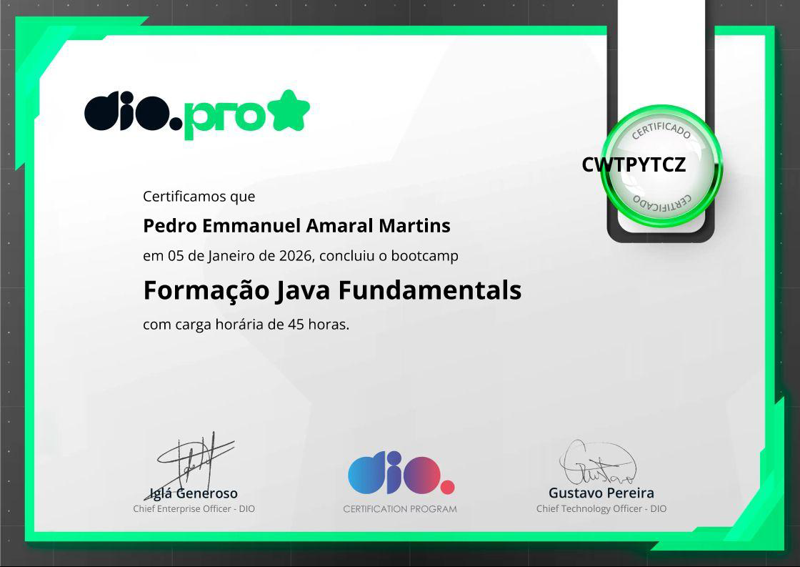

# 🧠 Formação Java Fundamentals
 

# 🧠 Formação Java Fundamentals | Módulo 1
## 📚 certificados

      

---

# 🧠 Formação Java Fundamentals | Módulo 2
## 📚 certificados
    
    

---

# 🧠 Formação Java Fundamentals| Módulo 3
## 📚 certificados
    
 

---

# 🧠 Blip - Formação Java Fundamentals| Módulo 4
## 📚 certificados
   
 

---

