# 🧠 Blip - Lógica de Programação
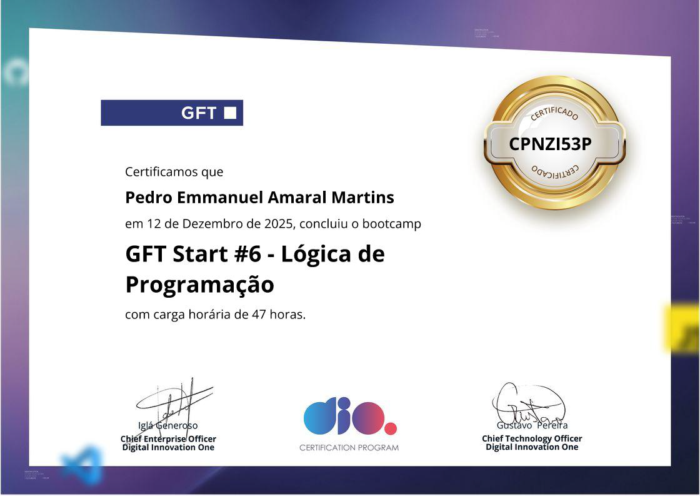

# 🧠 Blip - Lógica de Programação | Módulo 1
## 📚 certificados

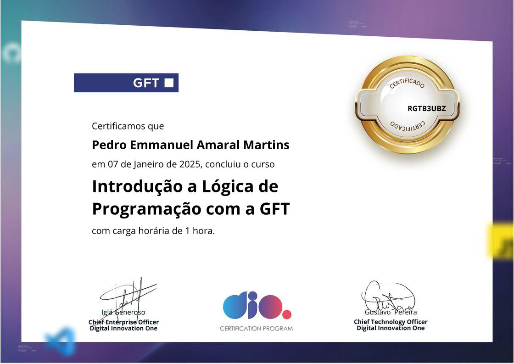 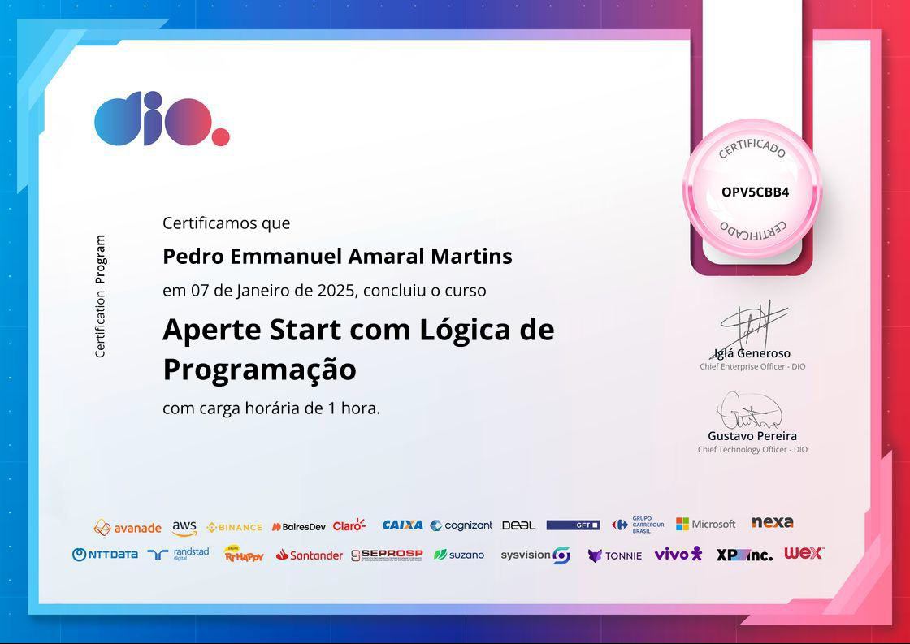 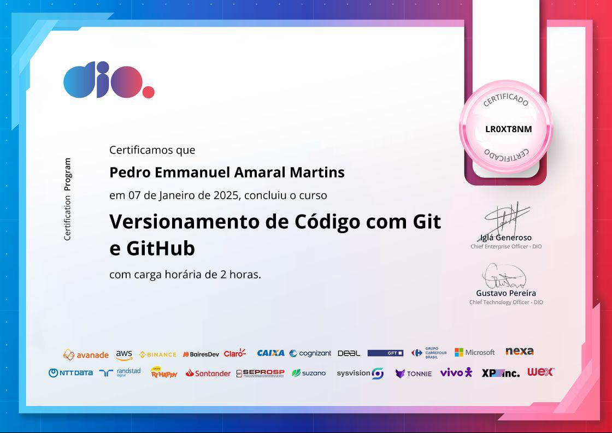 

 

---

# 🧠 Blip - Lógica de Programação | Módulo 2
## 📚 certificados
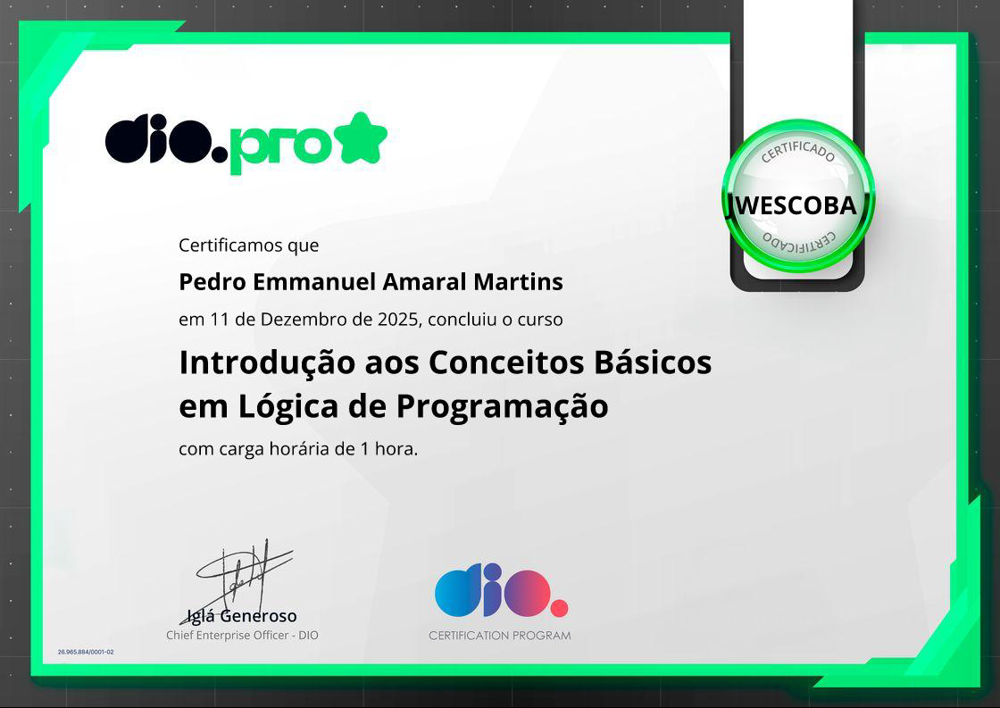   
      

---

# 🧠 Blip - Lógica de Programação | Módulo 3
## 📚 certificados
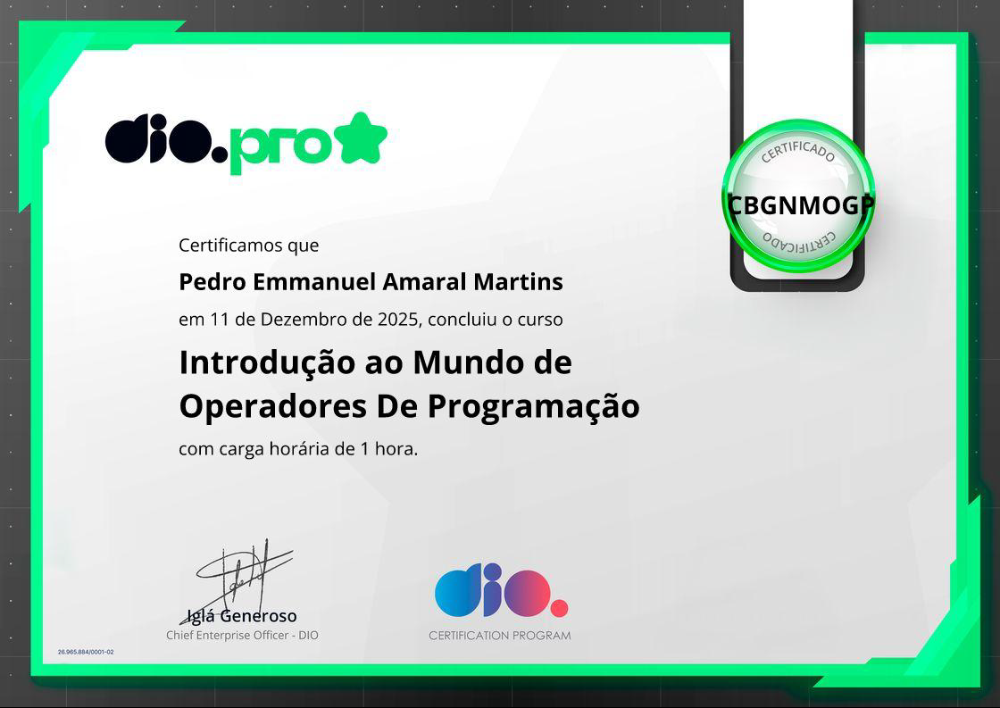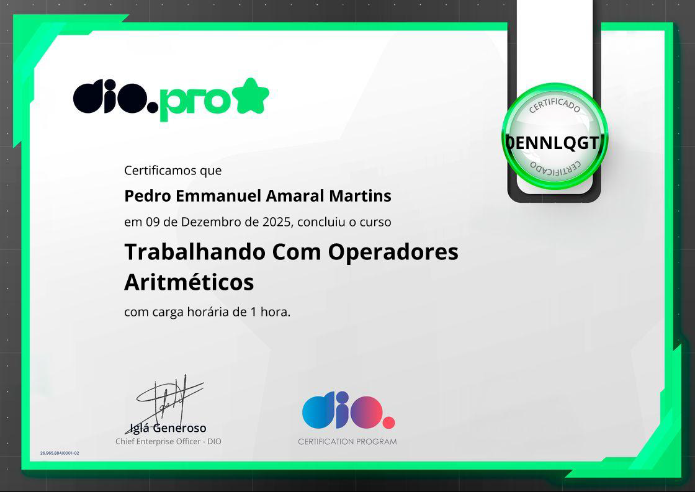 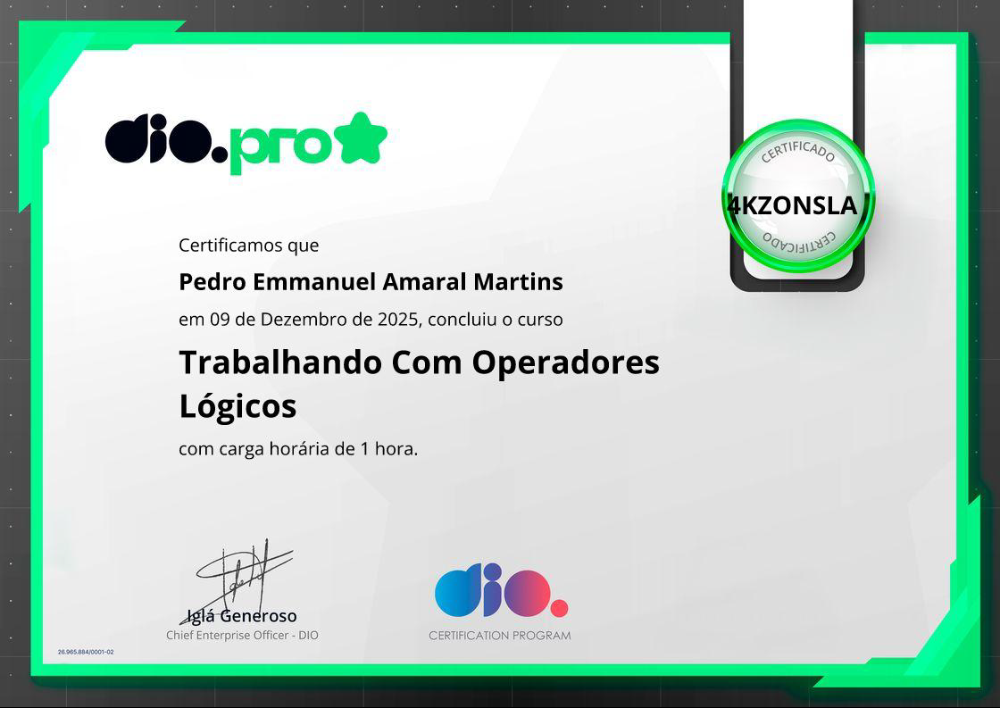 
     

---

# 🧠 Blip - Lógica de Programação | Módulo 4
## 📚 certificados
  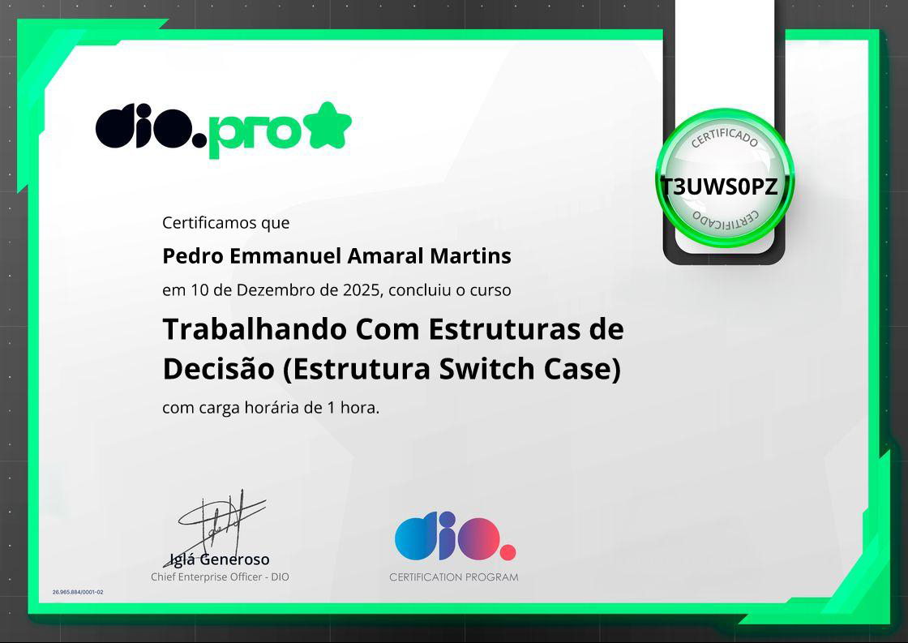 
 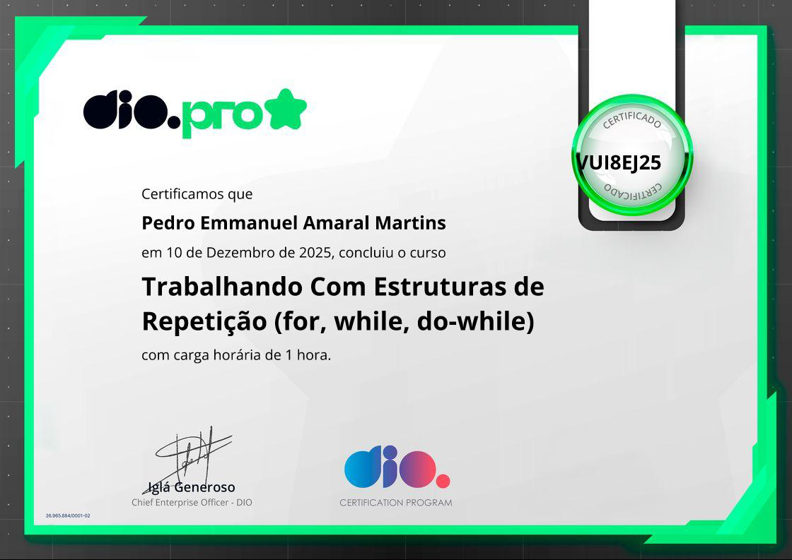 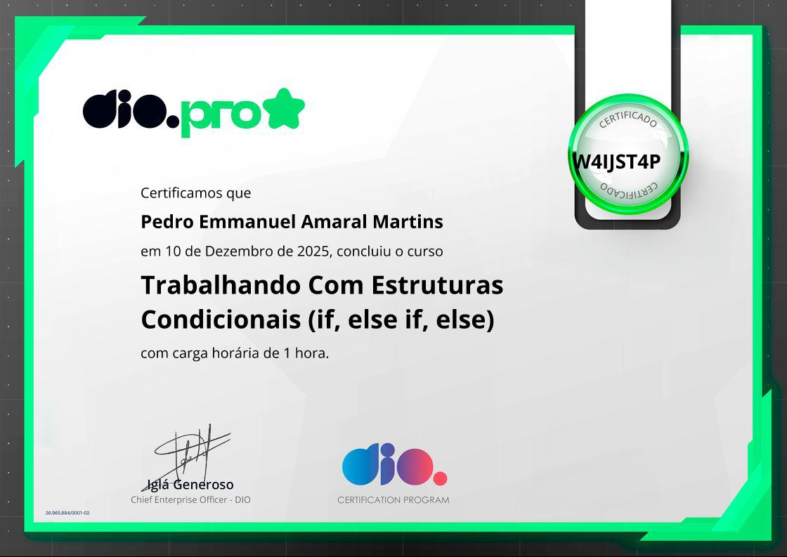 

---

# 🧠 Blip - Lógica de Programação | Módulo 5
## 📚 certificados

---

# 🧠 Blip - Lógica de Programação | Módulo 6
## 📚 certificados

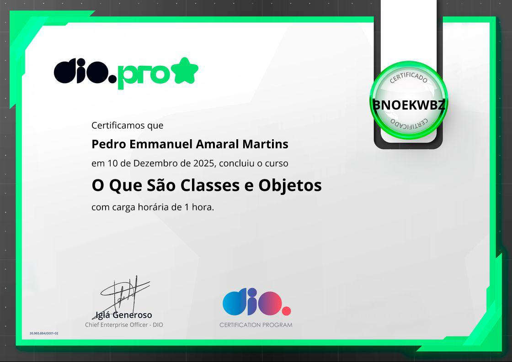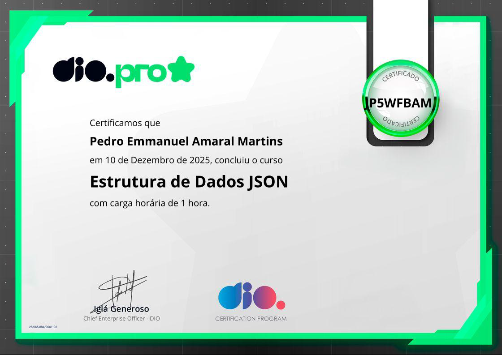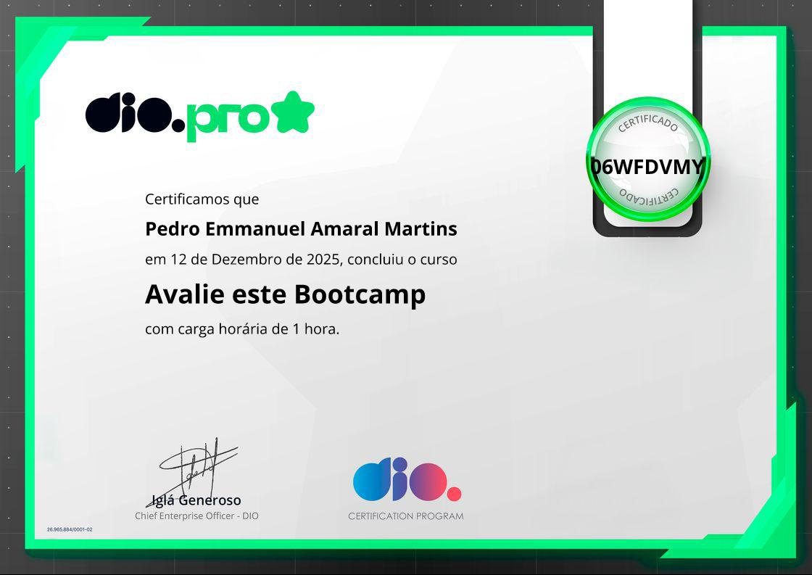
