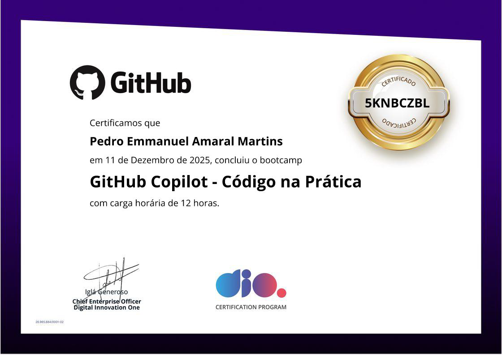

## 📄 Certificados 

Aqui estão os certificados referentes ao GitHub Copilot - Código na Prática da DIO.

---

   
 
  
 

# GitHub Copilot – Código na Prática

## ✨ Descrição  
Esse repositório reúne os exercícios / projetos práticos realizados no contexto do curso **GitHub Copilot – Código na Prática**. O objetivo é demonstrar o uso prático do GitHub Copilot para geração e auxílio no desenvolvimento de código, servindo tanto como portfólio quanto como base de estudo pessoal.

## 🧰 Tecnologias / Ferramentas  
- Git / GitHub  
- GitHub Copilot  

