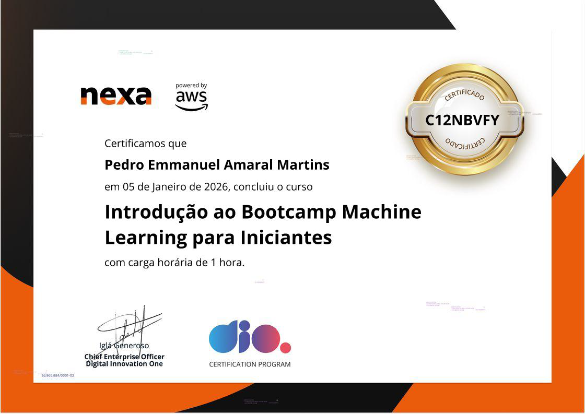

# 🧠 BliNexa - Machine Learning e GenAI na Prática

# 🧠 Nexa - Machine Learning e GenAI na Prática | Módulo 1
## 📚 certificados

  

---

# 🧠 Nexa - Machine Learning e GenAI na Prática | Módulo 2
## 📚 certificados
  
 

---

