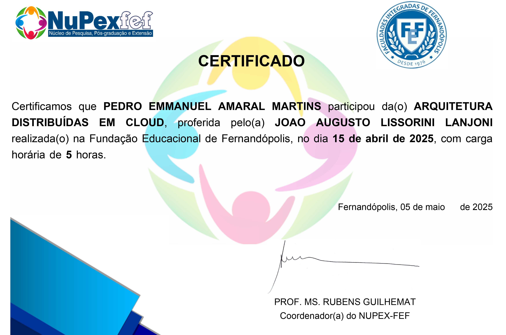
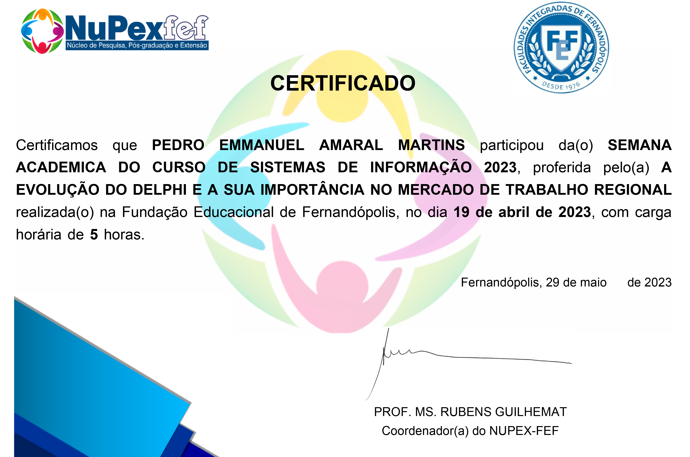
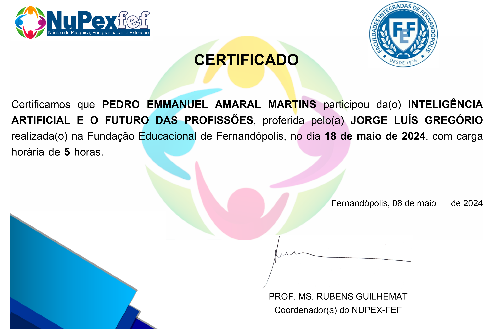
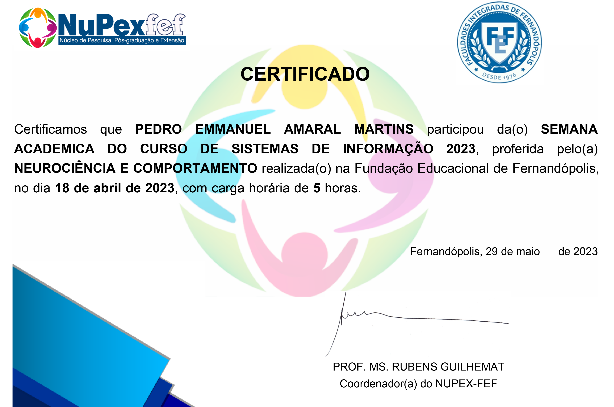

# Certificados – Atividade Complementar

Aqui estão os certificados referentes ao **Atividade Complementar** do curso **Fundação Educacional de Fernandópolis - FEF**.

---

## 📄 Certificados

> Todos os certificados estão disponíveis como imagens PNG e podem ser visualizados diretamente aqui no GitHub.

