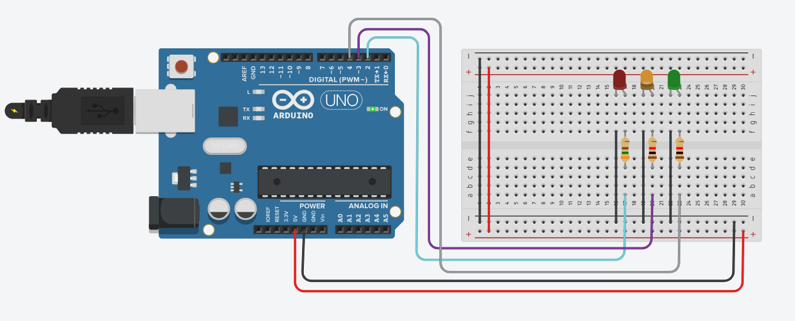
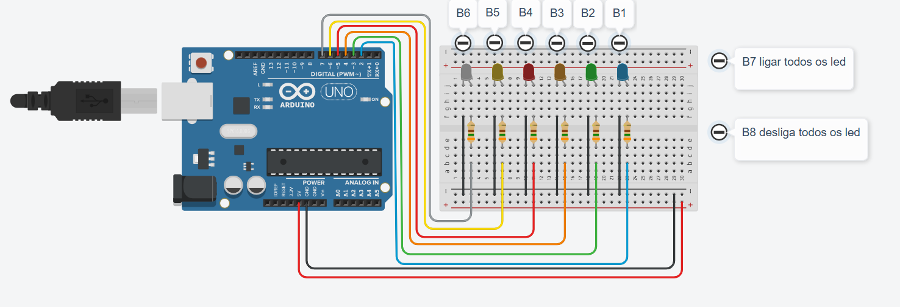

# 🚀 Projetos com Arduino

<table>
<tr>
<td align="center">

### 🌡️ Temperature Level Indicator

Sistema que monitora a temperatura e indica com LEDs.

</td>

<td align="center">

### 🚦 LED Sequence Controller

Sequência de LEDs simulando um semáforo.

</td>

<td align="center">

### 🎮 Controle de LEDs via Serial

Controle de LEDs via comandos no monitor serial.

</td>
</tr>
</table>
