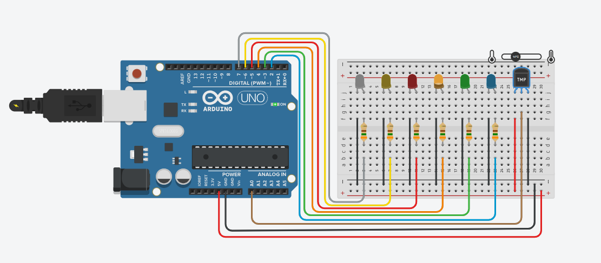

# 🚀 Meus Projetos com Arduino

---

## 🌡️ Temperature Level Indicator

Sistema que monitora a temperatura ambiente e indica visualmente através de LEDs.

🔗 https://github.com/PedroMartinsam/temperature-led-indicator

---

## 🚦 LED Sequence Controller

Projeto que simula uma sequência de LEDs semelhante a um semáforo.

🔗 https://github.com/PedroMartinsam/led-sequence-controller

---

## 🎮 Controle de LEDs via Serial

Sistema interativo que permite controlar LEDs através de comandos via monitor serial.

🔗 https://github.com/PedroMartinsam/controle-leds-serial

---
